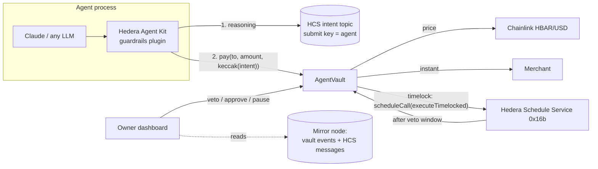

# Agent Guardrails

**Give your AI agent a wallet it can't drain.**

A [Scaffold-HBAR](https://github.com/hedera-dev/scaffold-hbar) template for letting AI agents spend money on Hedera under rules the chain enforces. A human funds an `AgentVault` and authorises agents with **USD limits**. Every payment an agent makes is priced by **Chainlink**, then routed by the contract into one of three lanes. A prompt-injected agent, or one whose key has been stolen, can only move what the policy allows.

```bash
npm create scaffold-hbar@latest -- --template nickthelegend/scaffold-hbar-agent-guardrails
```

| Lane | When | What happens |
|---|---|---|
| **Instant** | Allowlisted recipient, fresh price, within the per-payment and daily USD limits | Paid in the same transaction |
| **Timelock** | Allowlisted recipient, fresh price, over the instant limits but within the timelock budget | The vault **schedules its own execution with the Hedera Schedule Service**. The owner can veto until it fires. No keeper or cron is involved. |
| **Approval** | Unknown recipient, **stale or broken oracle**, or over every budget | Nothing moves until the owner approves (expires after 7 days) |

The agent also publishes its reasoning for every payment to an **HCS topic** only it can write to, and the vault stores the `keccak256` of that message. The dashboard shows "✓ verified on HCS" next to each payment, so you always know *why* your agent spent.

---

## Contents

- [Why this exists](#why-this-exists)
- [Quickstart](#quickstart)
- [Live on Hedera testnet](#live-on-hedera-testnet)
- [How it works](#how-it-works)
- [The agent side: Hedera Agent Kit plugin and Claude](#the-agent-side-hedera-agent-kit-plugin-and-claude)
- [The owner dashboard](#the-owner-dashboard)
- [Configuration](#configuration)
- [Testing](#testing)
- [Deploying your own](#deploying-your-own)
- [Hedera specifics worth knowing](#hedera-specifics-worth-knowing)
- [Security model and limitations](#security-model-and-limitations)
- [Hedera Harness](#hedera-harness)
- [Project layout](#project-layout)

## Why this exists

Agent frameworks, including the Hedera Agent Kit, ship *off-chain* hooks and policies, and they are useful: they stop a well-behaved agent from making mistakes. But a policy that runs inside the agent's process is only as strong as that process. If the prompt is injected, the code is modified, or the private key leaks, an off-chain policy is gone.

This template moves the policy **on-chain**, next to the money:

- **Limits are in USD, priced live by Chainlink.** Owners think in dollars, not in a volatile token.
- **Big payments are delayed, not blocked.** A legitimate large purchase still goes through after a veto window, and the network itself executes it via the Hedera Schedule Service. Nothing waits on a keeper bot that might be down.
- **The blast radius is computable.** The most an agent can move in any 24-hour window with nobody watching is `2 × dailyLimit + timelockBudget × (⌊24h ÷ vetoWindow⌋ + 1)`. (Two daily budgets can straddle midnight UTC.) The contract exposes it (`worstCaseDailyExposureUsd`) and the UI shows it next to each agent.
- **It fails safe.** If the oracle reverts, is stale, or returns a non-positive, absurdly large or future-dated answer, payments fall through to manual approval instead of trusting the price. The USD limits also cap how much a wrong-but-plausible price can cost you, because every lane is bounded.

## Quickstart

### Prerequisites

- Node.js ≥ 20.18.3 and Yarn (`corepack enable`)
- [Foundry](https://book.getfoundry.sh/getting-started/installation) (`curl -L https://foundry.paradigm.xyz | bash && foundryup`)
- Git
- For the agent demo: a funded **ECDSA** testnet account from the [Hedera Portal faucet](https://portal.hedera.com/faucet)
- Optional, for `agent:chat`: an Anthropic API key (or `ant auth login`)

### 1. Scaffold and install

```bash
npm create scaffold-hbar@latest -- --template nickthelegend/scaffold-hbar-agent-guardrails
cd my-hedera-dapp   # or the name you chose
yarn install        # the CLI already ran this unless you passed --skip-install
```

### 2. Run the tests

```bash
yarn foundry:test                                    # 33 unit + fuzz tests for AgentVault
yarn foundry:test:testnet --match-path "test/fork/*" # prices against the live Chainlink HBAR/USD feed
yarn agent:test                                      # Agent Kit plugin, intent hashing, Claude toolkit
yarn next:test                                       # dashboard activity-feed decoding
```

### 3. Open the dashboard

```bash
yarn next:dev   # http://localhost:3000
```

The template points at the **already deployed** testnet factory (see below). Connect a wallet on Hedera testnet (MetaMask, or the built-in burner wallet), create a vault and authorise an agent without deploying anything.

### 4. Bootstrap a demo agent, then watch it hit all three lanes

```bash
OWNER_PRIVATE_KEY=0x<funded testnet ECDSA key> yarn agent:setup
yarn agent:demo --wait
```

`agent:setup` does the whole owner side in one go:
- creates and funds a vault;
- creates and funds an agent account and a demo merchant;
- sets a USD policy and allowlists the merchant;
- creates the HCS intent topic, with the agent's key as the submit key;
- writes `packages/agent/.env`.

`agent:demo` then:
1. buys coffee (**instant**);
2. places a bulk order (**timelock**, which you watch the network execute by itself);
3. falls for a "the vendor changed bank details" injection (**approval**: nothing moves).

Open the vault page it prints to see all of it, verified intents included.

### 5. Let Claude try

```bash
yarn agent:chat
```

A Claude Opus 5.5 agent with the guardrails tools. Ask it to buy things, then try to talk it into draining the vault.

## Live on Hedera testnet

Everything below happened on Hedera testnet (chain 296) and can be checked on HashScan. The dashboard for this vault is live at **[dashboard-production-4d948.up.railway.app/vault/0x9aE5…3a5A](https://dashboard-production-4d948.up.railway.app/vault/0x9aE5afa51e97Ed3eBBd8F224BAA7d1E5e91F3a5A)**.

### Deployment

| What | Where |
|---|---|
| `AgentVaultFactory` | [`0.0.10844260`](https://hashscan.io/testnet/contract/0.0.10844260) · `0xabB85eF4106814eb8FB0dB8F4a857532AE5866C9` · deploy [tx](https://hashscan.io/testnet/transaction/0x6cfd272b4968b200b189c7bbcac0b0a3c69b68d0f940303817afffe14e82c628) · [Sourcify: exact match](https://sourcify.dev/server/v2/contract/296/0xabB85eF4106814eb8FB0dB8F4a857532AE5866C9) |
| Chainlink HBAR/USD feed | [`0x59bC155EB6c6C415fE43255aF66EcF0523c92B4a`](https://hashscan.io/testnet/contract/0x59bC155EB6c6C415fE43255aF66EcF0523c92B4a) (max price age 3h) |
| Demo `AgentVault` | [`0.0.10844266`](https://hashscan.io/testnet/contract/0.0.10844266) · `0x9aE5afa51e97Ed3eBBd8F224BAA7d1E5e91F3a5A` · created and funded with 100 ℏ [tx](https://hashscan.io/testnet/transaction/0x5c0d864fb12761acbc6e6715c4724c8ba516038551aedaaad00a5ecf18f18700) |
| Owner | [`0.0.10844255`](https://hashscan.io/testnet/account/0.0.10844255) |
| Agent | [`0.0.10844269`](https://hashscan.io/testnet/account/0.0.10844269) · `0xBDAD236a5635c54392f669E5B4E8F63E2A5072B0` |
| Demo merchant (allowlisted) | `0x035078ceafb85A706F37c8502B3C8f35a12936d0` [tx](https://hashscan.io/testnet/transaction/0x1c2b2a6751014b4c56a178063969acedd85e27dad9e45dfbbb7942bd9553ac19) |
| HCS intent topic (submit key = agent) | [`0.0.10844285`](https://hashscan.io/testnet/topic/0.0.10844285) · linked to the vault [tx](https://hashscan.io/testnet/transaction/0x5d74a2dda72d606d8299a5a08c6dcfd3c788c1df71d39412482a019b04030aa0) |
| Policy | $1 instant per payment, $5/day, $20 timelock budget, 3-minute veto window [tx](https://hashscan.io/testnet/transaction/0xf777bc39ba58bd5cb84d2ecd71fd0ede48db51a7560efa4f92ace65cb73e5bf6) · merchant allowlisted [tx](https://hashscan.io/testnet/transaction/0x07870093632e936de83b9f9b1bef4cf9866bc4fd98a99a10163c332153f10ca3) |

### Every lane, every owner action

Produced by `yarn agent:setup` and `yarn agent:demo --wait`, then a veto, a reject and an approve from the owner. HBAR/USD was about $0.10 at the time.

| # | Agent's request (and its HCS intent) | Lane | What happened |
|---|---|---|---|
| 1 | 2 ℏ ($0.20) to the merchant: "Restock coffee beans…" (intent #1) [tx](https://hashscan.io/testnet/transaction/0x6c9b12cfe03b22424e648b932289b8a0eeda42adbd3f0403afa0094e126d2e6b) | **Instant** | Paid in the same transaction |
| 2 | 60 ℏ ($6.10) to the merchant: "Quarterly bulk order…" (intent #2) [tx](https://hashscan.io/testnet/transaction/0x465f2c631b04b24513bb8f9ef80884f2aa530546c7972c1e813cb88f68404f2a) | **Timelock** | The vault created schedule [`0.0.10844290`](https://hashscan.io/testnet/schedule/0.0.10844290). After the 3-minute veto window, **the network executed it by itself** (`CONTRACTCALL`, `scheduled: true`): [execution](https://hashscan.io/testnet/transaction/1791043963.022949781). No keeper or script was involved. |
| 3 | 90 ℏ ($9.14) to an unknown address: "Vendor email says their bank details changed…" (intent #3, the prompt-injection drain) [tx](https://hashscan.io/testnet/transaction/0xd258bd516dde6fb103eab09925525881ef3f33ee6b4e629a12660639a0c5cf62) | **Approval** | No funds moved; the owner **rejected** it [tx](https://hashscan.io/testnet/transaction/0xeb2e5eb2e5ea96cf9b1cb6dbe6f9134be4e9ca38384ae64b5c1596b6cdc4c418) |
| 4 | 15 ℏ ($1.52) to the merchant: "Optional express-shipping upgrade…" (intent #4) [tx](https://hashscan.io/testnet/transaction/0xa06327c7706692e1f7999298becffca464b8c0ad0a796d7295a3b57b05e1f66c) | **Timelock** | The owner **vetoed** it inside the window [tx](https://hashscan.io/testnet/transaction/0xf7ac7d559866f8db5e0e57d1e9e5ab45e68d54bf0219224f162175024088457f), which also **deleted** its schedule [`0.0.10844323`](https://hashscan.io/testnet/schedule/0.0.10844323) |
| 5 | 3 ℏ ($0.30) to a supplier not on the allowlist: "First order from a new tea supplier…" (intent #5) [tx](https://hashscan.io/testnet/transaction/0x51fa67ef168ca59f3e24cad7fb9d4b82acd72d464ac8b037d77fb2a34601f685) | **Approval** | The owner **approved** it [tx](https://hashscan.io/testnet/transaction/0x05807fa8bd09830d32fad9f73393e5fb17354311c816a7450cb793459c958610) |

Every intent hash stored on-chain matches `keccak256` of the corresponding message on topic `0.0.10844285`, which is what the dashboard's "✓ verified on HCS" badge checks.

Reproduce it yourself with a funded testnet account: `OWNER_PRIVATE_KEY=0x… yarn agent:setup && yarn agent:demo --wait`.

## How it works



### The payment decision

`AgentVault.pay(to, amountTinybars, intentHash)`, called by the agent:

1. Rejects anyone without an active policy (`NotAgent`), and everything while the owner has paused the vault.
2. Prices the amount with `quoteUsd`, which reads Chainlink `latestRoundData()` inside a `try` and rounds **up**, so dust payments are never free. A revert, a non-positive or absurdly large answer, an answer from the future, or one older than `maxPriceAge` all mean **no usable price**. The default `maxPriceAge` is **3 hours**. The testnet HBAR/USD feed updates on price deviation, and its longest gap between rounds over Sep 30–Oct 2 2026 was about 2h08m, so a 1-hour window would wrongly send quiet-market payments to approval.
3. Picks a lane:
   - **Instant** if the price is usable, the recipient is allowed, `usd ≤ perTxLimitUsd`, and today's instant spend plus `usd` is within `dailyLimitUsd` (days are UTC).
   - **Timelock** if the price is usable, the recipient is allowed, the veto window is non-zero, outstanding timelocked USD plus `usd` is within `timelockCapUsd`, and the agent has fewer than `MAX_PENDING_TIMELOCKS` (10) pending. The vault calls `HSS.scheduleCall(address(this), now + vetoWindow, gas, 0, executeTimelocked(id))`.
   - **Approval** otherwise.
4. Emits `PaymentRequested(id, agent, to, amount, usd, lane, intentHash, executeAfter)`, so the dashboard can show the countdown even when scheduling failed.

### Why the timelock can't be abused

`timelockCapUsd` caps the **outstanding** timelocked amount, not each payment, and `MAX_PENDING_TIMELOCKS` caps how many are queued. That count matters because each one makes the vault pay for a scheduled transaction, so a hijacked agent can't drain the vault through schedule fees with thousands of dust requests. The owner sees every queued payment with a countdown and a Veto button. The dashboard pages through the vault's full log history, so a flood of junk requests can't push a pending one out of view. Vetoing also deletes the pending Hedera schedule. If the owner revokes the agent or removes the recipient during the window, the scheduled execution resolves as **vetoed** instead of paying. `approve` reverts if the vault can't pay, leaving the request pending rather than silently failing it.

### Hedera services and integrations used

| Service | Role | Where |
|---|---|---|
| **Chainlink Data Feeds** (HBAR/USD) | Converts USD limits to tinybars on every payment; staleness check routes to approval | `AgentVault.quoteUsd`, `test/fork/AgentVaultFork.t.sol` |
| **Hedera Schedule Service** (HIP-1215, `0x16b`) | The vault schedules its own timelocked executions. No keeper, no cron. | `AgentVault._scheduleExecution` |
| **Hedera Consensus Service** | Tamper-evident log of the agent's reasoning, attributable via the topic's submit key | `packages/agent/src/hcs.ts`, `cli/setup.ts` |
| **Smart contracts (EVM)** | `AgentVaultFactory` + `AgentVault` | `packages/foundry/contracts` |
| **Mirror node** | Dashboard indexer for vault events and HCS messages, so no backend is needed | `packages/nextjs/utils/guardrails/activity.ts` |
| **Hedera Agent Kit v4** | Plugin so any Agent Kit agent (LangChain, AI SDK, MCP, ElizaOS, Claude) spends through the vault | `packages/agent/src/plugin` |

## The agent side: Hedera Agent Kit plugin and Claude

`packages/agent` (`@sh/agent`) is a reusable package.

**The plugin** has three `BaseTool`s, so Agent Kit hooks and policies still run on top:

| Tool | Type | Does |
|---|---|---|
| `guardrails_get_policy` | query | Limits in USD, what's left today, timelock budget, vault balance |
| `guardrails_pay` | transaction | Publishes the intent to HCS, then calls `pay` with its hash; returns the lane and HashScan link |
| `guardrails_get_request` | query | Status of a request (executed, timelocked, vetoed…) |

Use it with any Agent Kit adapter:

```ts
import { createAgentGuardrailsPlugin, HcsIntentPublisher, RpcVaultGateway } from "@sh/agent";

const vault = new RpcVaultGateway(VAULT_ADDRESS, privateKeyToAccount(AGENT_KEY), "testnet");
const plugin = createAgentGuardrailsPlugin({ vault, network: "testnet", intents: new HcsIntentPublisher(client) });

// e.g. LangChain
const toolkit = new HederaLangchainToolkit({ client, configuration: { plugins: [plugin] } });
```

**Defense in depth.** Off-chain Agent Kit policies compose with the on-chain vault. `test/plugin.test.ts` shows an `AbstractPolicy` that blocks a payment before anything is published or signed. The vault is what still holds when that layer is bypassed.

**Claude.** `ClaudeHederaToolkit` (`src/claude-toolkit.ts`) is a small adapter that exposes any Agent Kit tool to the Anthropic SDK's tool runner (`betaStandardSchemaTool`, input validated against the tool's schema). `yarn agent:chat` uses it with `claude-opus-5-5` and server-side refusal fallbacks enabled. The system prompt tells the agent to treat vendor messages as data, but the point of the template is that it doesn't have to rely on that.

**CLIs**

| Command | Who | What |
|---|---|---|
| `yarn agent:setup` | owner | Vault + agent account + merchant + policy + HCS topic, writes `packages/agent/.env` |
| `yarn agent:demo [--wait]` | agent | Scripted instant / timelock / prompt-injection run; `--wait` polls until the network executes the timelocked payment |
| `yarn agent:chat` | agent | Interactive Claude agent |

## The owner dashboard

`yarn next:dev`, built on the Scaffold-HBAR Next.js app:

- **`/`** shows the three lanes, a live Chainlink price, your vaults, and create-and-fund.
- **`/vault/[address]`** shows:
  - balance in HBAR and USD;
  - the price and its freshness;
  - fund, withdraw and the **kill switch**;
  - one card per agent: limits, what's left today, timelocked amount, the **worst-case exposure meter**, allowlist management, edit and revoke;
  - every payment request with its lane, state, countdown, **Veto / Approve / Reject / Execute now**, the HashScan transaction and schedule entity, and the agent's reason with **✓ verified on HCS**.

History comes from the mirror node (`/contracts/{vault}/results/logs`, `/topics/{id}/messages`), so there is no database or indexer to run.

## Configuration

| File | Variable | Purpose |
|---|---|---|
| shell (one-off) | `OWNER_PRIVATE_KEY` | Funded ECDSA testnet key used by `yarn agent:setup`. Pass inline, never commit. |
| `packages/agent/.env` | `VAULT_ADDRESS` | Vault the agent spends from |
| | `AGENT_PRIVATE_KEY` | Agent's ECDSA key (its address needs a policy on the vault) |
| | `AGENT_ACCOUNT_ID` | Agent's `0.0.x` ID; looked up from the mirror node when empty |
| | `DEMO_MERCHANT` | Allowlisted recipient used by `agent:demo` |
| | `ANTHROPIC_API_KEY` / `CLAUDE_MODEL` | For `agent:chat` (defaults to `claude-opus-5-5`) |
| `agent:setup` overrides | `VAULT_FUND_HBAR` `AGENT_FUND_HBAR` `PER_TX_USD` `DAILY_USD` `TIMELOCK_CAP_USD` `VETO_WINDOW_SECONDS` `FACTORY_ADDRESS` | Demo policy and funding |
| `packages/nextjs/.env.local` | `NEXT_PUBLIC_HEDERA_TESTNET_RPC_URL` `NEXT_PUBLIC_WALLET_CONNECT_PROJECT_ID` | Optional RPC override and WalletConnect project |
| deploy | `HBAR_USD_FEED` | Feed for `Deploy.s.sol` (defaults to testnet HBAR/USD) |

`.env` files are git-ignored; `packages/agent/.env.example` documents the agent variables.

## Testing

| Suite | Command | What it proves |
|---|---|---|
| Contract unit + fuzz | `yarn foundry:test` | Lane routing, limits, daily reset, rounding, timelock scheduling and firing within its gas limit, veto (and schedule deletion), revoke-as-veto, the pending-timelock cap, approvals and expiry, kill switch, missed, failed or absent Schedule Service, insufficient balance, access control, and a fuzz test that instant spend never exceeds the daily limit |
| Live testnet fork | `yarn foundry:test:testnet --match-path "test/fork/*"` | `quoteUsd` against the real Chainlink HBAR/USD feed; fail-safe on stale answers |
| Agent | `yarn agent:test` | Intent canonicalisation and hashing, HCS publish-then-pay ordering, lane messages, account-ID resolution, Agent Kit policy composition, Claude tool schemas |
| Frontend | `yarn next:test` | Decoding real ABI-encoded logs (served newest-first, as the mirror node does) into request rows, allowlist replay, intent verification |
| Live end-to-end | `yarn agent:setup && yarn agent:demo --wait` | All three lanes on testnet, including a Schedule Service execution |

Unit tests etch a recording Schedule Service at its real system address (`0x16b`) and use a mock price feed, because neither exists in a local EVM. The fork test and the live demo run against the real ones.

## Deploying your own

```bash
yarn foundry:account:generate        # or foundry:account:import
yarn foundry:deploy --network hedera_testnet
```

Use `HBAR_USD_FEED=0x... yarn foundry:deploy --network hedera_mainnet` for mainnet. Chainlink's Hedera mainnet HBAR/USD feed is `0xAF685FB45C12b92b5054ccb9313e135525F9b5d5`. The deploy writes `packages/nextjs/contracts/deployedContracts.ts`, so the dashboard picks up the new factory automatically.

## Hedera specifics worth knowing

- **Two HBAR units.** Inside contracts, `msg.value` and `address.balance` are **tinybars** (8 decimals). The JSON-RPC relay takes transaction `value` in **weibars** (18 decimals). The vault stores and emits tinybars. Use `hbarToWeibars` when sending and `hbarToTinybars` for `pay` (`packages/agent/src/units.ts`).
- **Schedule Service capacity.** `scheduleCall` can fail if a second is full. The vault checks `hasScheduleCapacity` through low-level calls and never reverts the payment because of scheduling. It emits `ScheduleFailed`, and `executeTimelocked` stays permissionless after the veto window. The dashboard shows "Execute now" when that happens.
- **Scheduled executions are paid for by the vault**, from its HBAR balance, so keep a little headroom above what agents may spend.
- **Gas estimates undercount system-contract work.** The relay's `eth_estimateGas` estimated 66k gas for `veto` (which deletes a schedule), but consensus used 111k, so the first attempt failed with `INSUFFICIENT_GAS`. `pay` came within 6% of its estimate. The dashboard and the agent therefore send **twice the estimate**. Hedera charges at least 80% of the gas limit, so this costs a fraction of a cent on testnet.
- **EIP-1559 fee estimation.** The relay's fee history makes viem estimate an almost-zero `maxFeePerGas`, which the relay then rejects (minimum ~870 gwei). `hederaChain()` in `packages/agent/src/network.ts` prices transactions from `eth_gasPrice` instead.
- **`block.timestamp` is the hashgraph consensus timestamp** (median of node clocks). That's why the `block-timestamp` lint is disabled in `foundry.toml`.
- **HCS messages are capped at 1 KiB** unchunked. Intents trim the reason, by character and never mid-codepoint, until the UTF-8 encoding fits. The canonical encoding keeps the hash reproducible by anyone reading the topic.
- **Forking Hedera contracts with immutables.** The relay returns runtime bytecode with immutable references zeroed for some contracts, so fork tests should target storage-based contracts (like Chainlink proxies) or use live calls.

## Security model and limitations

- The **owner** can withdraw, pause, change policies and approve anything. The vault protects owners from agents, not agents from owners.
- **Approved payments and timelocked executions don't count toward the daily instant budget**, because they were explicitly sanctioned or vetoable.
- The worst-case bound assumes the owner never reacts. Shorter veto windows mean more exposure per day; the UI shows the exact figure. It covers payments, not the small HBAR fees the vault pays for (at most 10 pending) scheduled executions.
- Splitting a payment into many small ones only works within the daily instant limit.
- HBAR payments only. HTS token payments (e.g. USDC) are the natural next step: price them 1:1 for stablecoins or via a second feed.
- Not audited. Treat it as a starting point.

## Hedera Harness

`.harness/` contains a [Hedera Harness](https://github.com/hedera-dev/hedera-harness) recipe:

| File | Tier |
|---|---|
| `spec.yaml`, `prd.md` | Recipe and requirements |
| `validators/static.json` | Tier 0–1: required files and manifest invariants |
| `validators/yarn.json` | Tier 0–1: lint, contract, agent and frontend tests, build |
| `validators/playwright-smoke.yaml` | Tier 2: routes render without errors |
| `acceptance-contract.json` | Tier 3: create a vault, authorise an agent, kill switch |
| `chainValidation` in `spec.yaml` | Tier 3.5: an ephemeral funded signer runs the on-chain flow |

```bash
yarn harness:doctor
yarn harness:validate
```

## Project layout

```
packages/
  foundry/                 Solidity (Foundry)
    contracts/AgentVault.sol, AgentVaultFactory.sol, interfaces/
    script/Deploy.s.sol
    test/AgentVault.t.sol, fork/AgentVaultFork.t.sol, mocks/
  agent/                   @sh/agent: Agent Kit plugin, Claude toolkit, CLIs
    src/plugin/            guardrails_* tools
    src/claude-toolkit.ts  Agent Kit → Anthropic tool runner adapter
    src/vault.ts           typed vault client (viem)
    src/intent.ts, hcs.ts  canonical intents, HCS publisher
    src/cli/               setup, demo, chat
  nextjs/                  owner dashboard (App Router, RainbowKit, wagmi, DaisyUI)
    app/page.tsx, app/vault/[address]/page.tsx, app/api/health
    components/guardrails/, hooks/guardrails/, utils/guardrails/
.harness/                  Hedera Harness recipe
```

## License

MIT. See [LICENCE](LICENCE).
